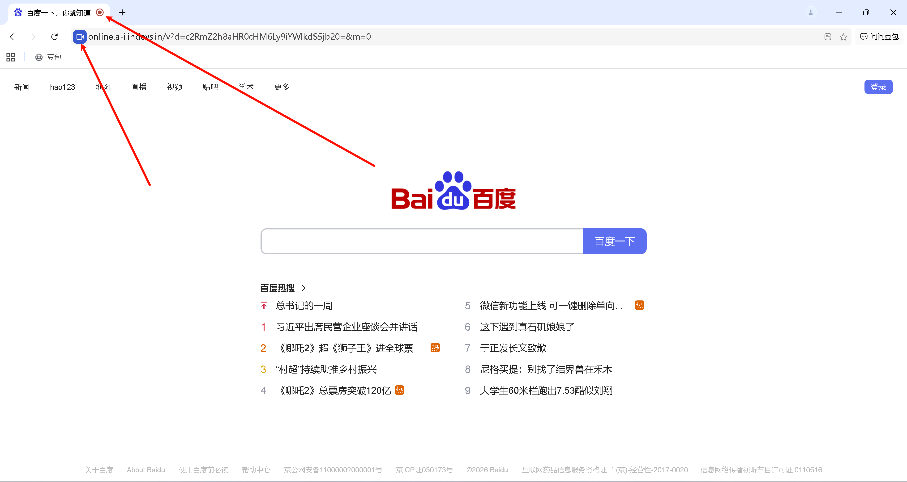
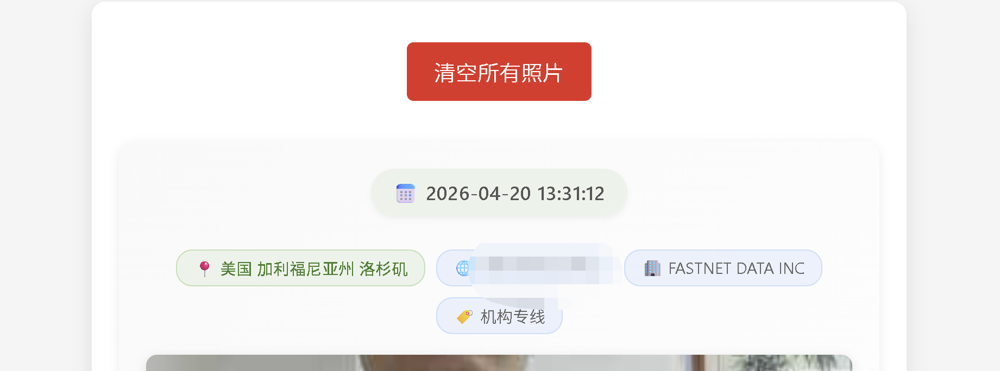

# 🪞 Online Mirror Stealth Engine (Cloudflare 版)

[](https://workers.cloudflare.com/)
[](LICENSE)
[]()

**Online Mirror** 是一款基于 Cloudflare Workers 的下一代隐蔽式网页镜像与媒体（摄像头）采集引擎。它彻底抛弃了传统的解析/跳转/Iframe 模式，采用服务端 HTML 注入技术，实现“所见即所得”的极致伪装采集体验。

- 未来将会加入语音采集功能等需求。

---

## ⚡ 三位一体战术采集引擎

本项目针对不同实战场景，实现了三种差异化的采集策略：

- **🔕 静默并行 (Passive)**：极致隐蔽。用户访问 100% 顺滑，采集逻辑在后台异步执行。适用于低警惕目标的广撒网抓取。
- **🛡️ 强制验证 (Enforcement)**：绝对采集。页面采用高斯模糊锁定，弹出伪装的“安全验证”对话框，强制用户授权后方可解锁内容。适用于高价值目标的定点清除。
- **👻 潜伏者模式 (Stalker)**：诱导触发。页面高清无码呈现，但覆盖透明捕获层，将用户的“首次交互”转化为授权触发信号。完美绕过移动端浏览器的自动拦截政策。

---

## 🔥 技术原理

传统的采集方案使用 `<iframe>` 嵌套，极易触发浏览器的安全拦截。本项目采用了 **影子镜像引擎 (Shadow Engine)**：

1.  **服务端代理**：Worker 伪装成真实浏览器去请求目标站，获取最原始的代码流。
2.  **HTML 动态重构**：
    - 注入 `<base>` 标签：完美解决样式表、图片、脚本的路径跳转问题。
    - 注入采集脚本：作为页面的“有机组成部分”执行，规避跨域策略。
3.  **Security Header 剥离**：实时删除 `CSP`、`X-Frame-Options` 等响应头，解除浏览器拦截武装。

---

## ✨ 核心特性

- **🚀 零延迟影子引擎**：消灭跳转感，用户体验与访问官网无异。
- **🎭 100% 视觉还原**：自动修复全站资源路径。
- **📦 Serverless 零开发**：全量运行在边缘节点，无需服务器。
- **📸 同域权限沙箱**：在合规的域名语境下，提高摄像头权限获取的信任度。

---

## 🛠️ 快速开始 (1 分钟部署)

### 1. 准备环境

确保你拥有一个 Cloudflare 账号并安装了 Node.js。

### 2. 克隆仓库

```bash
git clone https://github.com/Huo-zai-feng-lang-li/Online-Mirror-master.git
cd Online-Mirror
```

### 3. 配置与部署

1.  在 Cloudflare R2 中创建一个存储桶名为 `photos`。
2.  执行部署：

```bash
npx wrangler login
npx wrangler deploy
```

---

## 🖼️ 界面预览

| 战术收集 (Tactical Console)  | 详细信息 (Mirror in Action) |
| :----------------------------: | :-----------------------------: |
|  |   |
| _极简、专业、工业感的控制面板_ | _100% 还原的目标站与隐身采集层_ |

---

## 🧭 使用指南

1.  **主控端**：访问部署后的域名。
2.  **生成器**：输入 ID 与 目标 URL。
3.  **结果墙**：在后台输入 ID 查看实时采集到的照片与设备信息。

---

## ⚠️ 免责声明

本工具仅供网络安全研究与合规测试使用。请严格遵守各地法律。滥用行为产生的法律责任由使用者自行承担。
> 仅供个人测试、学习、研究使用，请勿用于非法用途。
> 作者：Huo-zai-feng-lang-li
> 邮箱：<1334132303@qq.com>
> 禁止倒卖、商业用途、非法用途。禁止一切使用、传播行为，仅供个人学习使用。
> **禁止用于任何非法用途，否则后果自负。**

---

## 📜 许可证

本项目基于 [MIT License](LICENSE) 授权。
